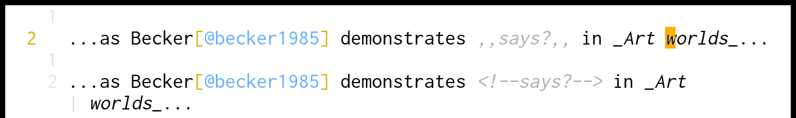

commarkdowncomment
==================



[pandoc luafilter](https://pandoc.org/lua-filters.html) and [vim](https://www.vim.org/) syntax file for a [markdown](https://pandoc.org/MANUAL.html#pandocs-markdown) __comment style__ with `,,` instead of html comments (which are sooo long).

why
---

in my writings practices, i tend to use comments a lot, for example to send an unfinished version full of comments addressed to myself (when i'm unsure of a formulation, when i cannot chose between synonyms, ...). and the HTML comment tags are sometimes even longer that the comment itself:

```markdown
...as Becker demonstrates <!--says?--> in _Art worlds_...
```

i prefer a shorter and easier-to-write syntax. as i never use double commas in my texts, and as commas are very accessible in many keyboards, it seems a good option.

usage
-----

just put the luafilter somewhere and run `pandoc` with `-L [filepath]` option:

```bash
pandoc -L ./luafilter/commacomment.lua 
    \ -i README.md -o README.pdf -f markdown -t pdf
```

for vim, just append the content of `./after/syntax/markdown.vim` to the file `after/syntax/markdown.vim`.
